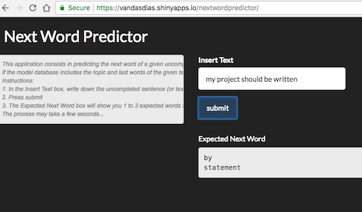

```{r setup, include=FALSE}
knitr::opts_chunk$set(echo = FALSE)
```

## Next Word Predictor - Aim {.smaller}

This presentation is part of the Capstone Project for the Data Science Specialization run by the Johns Hopkins University.

The project consists in **building a predictive text model that presents options for what the next word might be** given an uncompleted sentence or text.

The predictive text model is built using **natural language process tools** and is based on a **large corpus of text documents**. This presentation summarizes the model building concepts and shows how the **website application** built for it works.

<br>
Web App: https://vandasdias.shinyapps.io/nextwordpredictor/

Support Documentation: https://github.com/VandaDias/Capstone


## Next Word Predictor - Model App {.smaller}

Instructions:

1. In the Insert Text box, write down the uncompleted sentence (or text),

2. Press submit,

3. The Expected Next Word box will show you 1 to 3 expected words to write next.




## Next Word Predictor - Algorythm {.smaller}

The predictive text model was built having a large corpus of text documents from three types of sources: blogs, twitter and news texts.

The model was built in R using two methods: n-gram and topic model mainly trough the R packages: quanteda and topic models.

The method **n-gram** consists in segmenting a corpus within a set of n tokens, in this case words.

- word tokenization (with removal of punctuation, numbers and symbols),

- 4-gram to 2-gram analysis (if no prediction for a higher gram, n-1 is applied)

The **topic model** uses a Latent Dirichlet allocation (LDA) method for "clustering" the n-gram segments.

- k=10, 10 clusters have been applied

The **accuracy** for this model is low (less than 0.20) if considering the match with the first predictive word only. However, it should improve significantly if using a much larger training set.


## Next Word Predictor - Relevant Algorythm Info {.smaller}

- **no specific differentiation by type of source (blogs, twitter or news)** - the use of topic models makes the training set to became even smaller for each topic (split it more would loose accuracy) but it may differentiate it internally by topic;

- **only 30% of the data has been used** - there were hardware limitation issues as the project is being developed in a personal computer. However, the main concepts are present and the code can be reproduced to a larger scale;

- **no use of word stemming when tokenizing** - word stem would help differentiate topics but it was dropped off as the aim is to predict the exact next word;

- **the model has been split into two parts: a precedent to create the topic + n-gram databases and another to predict the next word** - it significantly improved the speed search as the first part would take a significant amount of time to run if needed for every single search.
